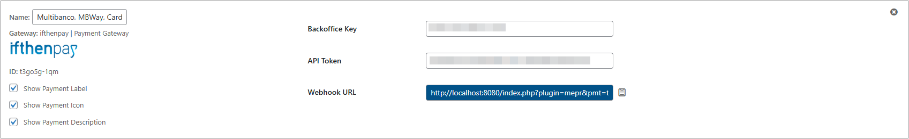
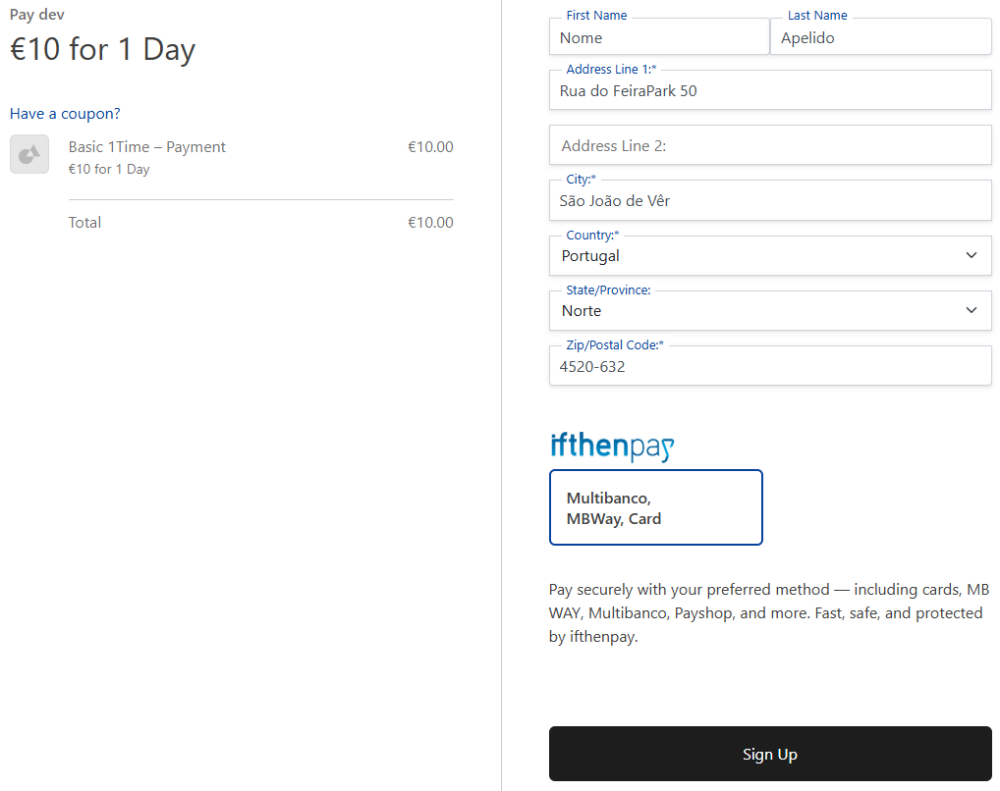
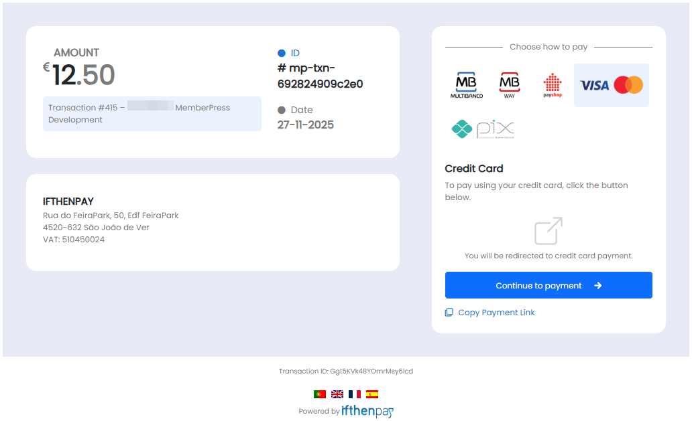
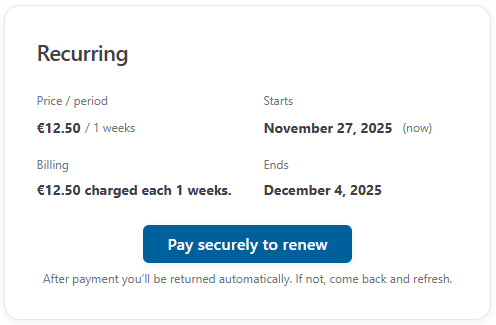
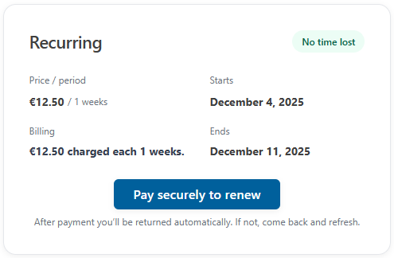
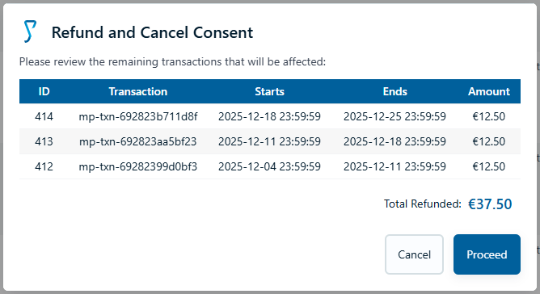

# ifthenpay | Payments for MemberPress

Adds ifthenpay payment methods to MemberPress: cards, wallets, local bank transfers; supports one-time and period-based recurring memberships.

Includes partial refunds, a merchant backoffice (basic sales & refunds), and secure signed callbacks for automatic payment confirmation.

---

## Table of Contents

- [Description](#description)
- [Key Features](#key-features)
- [How Period-Based Recurrence Works](#how-period-based-recurrence-works)
- [Requirements](#requirements)
- [Installation](#installation)
- [Frequently Asked Questions](#frequently-asked-questions)
- [Refund Policy Management](#refund-policy-management)
- [External Services](#external-services)
- [Screenshots](#screenshots)
- [Support](#support)

## Description

ifthenpay does not offer built-in recurring billing. This plugin makes recurring memberships work by creating simple, easy-to-understand payment periods. When a period is paid, the membership continues; if not paid, MemberPress marks that period as "Lapsed" and the system waits for the end-customer to **Update** their subscription by making a manual payment for the next computed period. Periods are computed sequentially so customers never lose paid time — the next period is only created after the previous one is completed. An admin may also change the subscription status if needed.

### In plain terms you get:

- One-time payments and recurring memberships (period engine)
- Partial refunds you control
- Merchant backoffice (basic sales & refunds) on web + mobile
- Secure automatic payment confirmations (no card numbers stored)

All settings are made in MemberPress and in your ifthenpay Backoffice. The plugin is built so store owners can manage payments without needing deep technical knowledge.

## Key Features

1. Period-based recurring (sequential, preserves paid time)
2. One-time payments (standard purchase flow)
3. Automatic payment confirmation (fast access)
4. Lapsed period handling with manual Update action
5. Admin partial refunds (future/unconsumed periods)
6. Multiple local payment types (cards, wallets, transfers)
7. Merchant backoffice (basic sales & refund reports)
8. Security first (signed callbacks, no card data stored)

## How Period-Based Recurrence Works

1. User purchases a membership with a cycle (e.g. monthly).
2. The plugin creates the first payment period and a payment reference for that period.
3. When payment is received, the period is marked paid and the next period is prepared. Periods are computed sequentially to avoid overlap and preserve any paid time for the customer.
4. Admins can generate or edit periods from the transactions screen.

## Requirements

- An active ifthenpay merchant account.
- A Gateway Key for MemberPress (request this from ifthenpay support/helpdesk).
- The payment methods you want enabled on that Gateway Key (your ifthenpay backoffice lets you choose).
- WordPress 5.0+, PHP 7.4+, and MemberPress installed.
- HTTPS (SSL) enabled on your site.

## Installation

1. **Install:** Upload the plugin zip via `Plugins → Add New → Upload`, or install from WordPress.org and Activate.
2. **Credentials:** Request an ifthenpay Gateway Key for MemberPress and ensure desired payment methods are enabled.
3. **API Token:** In Backoffice → Administration → Integrations create a MemberPress integration; copy API Token & Backoffice Key.
4. **Payment Configuration:** After creating the API Token, click the settings button (⚙️ icon) to configure the desired payment accounts and payment behaviour.
5. **Gateway setup:** MemberPress → Settings → Payments → Add Gateway → choose "ifthenpay | Payment Gateway"; enter API Token & Backoffice Key; save.
6. **Test:** Make a low-value test payment and confirm callback marks the period Paid.

### Troubleshooting

- Callback not firing / period not advancing: confirm HTTPS reachability + correct registered callback URL.
- Method missing at checkout: ensure enabled on Gateway Key AND mapped in Backoffice Integrations.

## Frequently Asked Questions

<strong>Does ifthenpay now support real recurring billing?</strong>

No. ifthenpay does not provide native recurring billing. This plugin makes recurring memberships work using payment periods as described above.

<strong>Are payment details stored?</strong>

No. The plugin does not store card numbers or full bank details. Only small references needed for matching payments are kept.

<strong>How are partial refunds calculated?</strong>

Admins enter the desired refund amount per transaction or period when issuing a refund. The plugin can suggest values but the admin finalizes and approves the refund.

<strong>What happens if a user misses a period payment?</strong>

The subscription period is marked Lapsed in MemberPress. The customer must Update their subscription (manual payment for the next period) to restore active access; Admins can also reinstate by manually changing the status.

<strong>Can I customize period lengths?</strong>

The integration reads the membership’s subscription schema (period type and amount) and automatically computes the next periods and transactions.

<strong>Do upgrades/downgrades recalculate periods?</strong>

Yes. Future periods are recalculated; current period may optionally prorate (configurable).

<strong>Is there a sandbox?</strong>

ifthenpay may provide test entities; if unavailable, use a low-value live test. Future roadmap includes an internal simulation mode.

<strong>Which payment methods are supported?</strong>

Any ifthenpay method attached to the Gateway Key (e.g. Multibanco, MB WAY, Payshop, Pix, Credit Card if provisioned).

<strong>How secure is the integration?</strong>

Callbacks are signed; requests are encrypted over HTTPS; data minimized; nonces protect admin forms.

<strong>Does this replace MemberPress trials?</strong>

Trials still work; the first period can be zero-amount and becomes payable only when the trial ends.

## Refund Policy Management

**Scope:** refunds apply only to future or unconsumed paid periods (no retroactive time reimbursement).
**Process:**

- Admin inputs desired refund amount per transaction/period.
- Optional min/max limits can guide consistency.
- Approval required before issuing ifthenpay refund or internal credit note.

## External Services

This plugin integrates with the ifthenpay payment platform to process payments for MemberPress memberships. ifthenpay is a third-party service that provides secure payment processing for various methods including cards, wallets, and local bank transfers.

- **ifthenpay Backoffice & Integrations**

  - **What it is and what it is used for**: The ifthenpay Backoffice is the merchant dashboard for managing payment integrations. The plugin uses the ifthenpay API to retrieve account configuration, generate payment links, activate webhooks, and process refunds.
  - **What data is sent and when**:
    - During setup: Backoffice Key and API Token (stored securely in site settings) to authenticate and retrieve available payment methods.
    - During payment processing: Minimal transaction details including transaction ID, user identifier, amount, and subscription details to generate payment references.
    - During refunds: Backoffice Key, request ID, and refund amount to process partial refunds.
  - **End-User License Agreement (EULA)**: [EULA](https://ifthenpay.com/eula/)
  - **Privacy Policy**: [Privacy Policy](https://ifthenpay.com/politica-de-privacidade/)

- **Callbacks / Webhooks**
  - **What it is and what it is used for**: Webhooks (callbacks) are used for automatic payment confirmations. When a payment is completed, ifthenpay sends a signed notification to the plugin to update the transaction status in MemberPress.
  - **What data is sent and when**: Only upon payment completion: reference IDs, payment status, amount, payment method, and request ID. No sensitive card or bank details are transmitted.

All network requests are performed server-side over HTTPS. Sensitive credentials are stored in site options and are not publicly exposed. The plugin does not store raw card numbers or full bank account details.

## Screenshots

Below are screenshots demonstrating key features and interfaces of the plugin:

1. **Gateway Settings under MemberPress Payments Settings**
   

2. **Checkout example for a basic one time subscription**
   

3. **ifthenpay Gateway page**
   

4. **Update Card for Lapsed Recurrent Subscription**
   

5. **Update Card for an Active Reccurrent Subscription (buying the next period)**
   

6. **Refund and Cancel consent (Admin only), future periods that will be refunded**
   

## Support

For assistance use the [WordPress.org support forum](https://wordpress.org/support/plugin/ifthenpay-payments-for-memberpress/):

Include when opening a ticket:

- Backoffice account
- Site URL + plugin version
- Exact error message + log excerpts / screenshots

Pre-checks:

- Callback URL reachable over HTTPS & matches settings
- Payment method enabled on Gateway Key AND mapped to Integration
- Running current recommended versions of WordPress, PHP & MemberPress

Commercial helpdesk available (no direct email required): [helpdesk.ifthenpay.com](https://helpdesk.ifthenpay.com/)

- **ifthenpay support**: [suporte@ifthenpay.com](mailto:suporte@ifthenpay.com)
- **MemberPress docs**: [MemberPress docs](https://memberpress.com/docs/)
